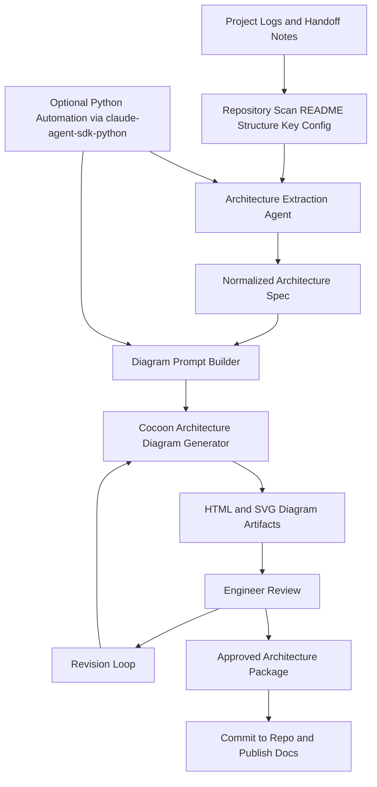

# Project Log to Architecture Flow

## Usage

- Fill `playbooks/architecture-spec-template.md` first.
- Feed the resulting architecture block into `architecture-diagram-generator`.
- Save outputs as versioned artifacts next to project docs.
